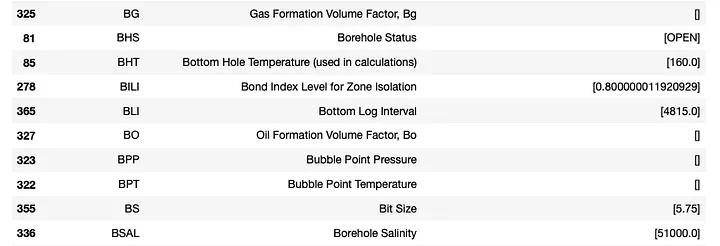
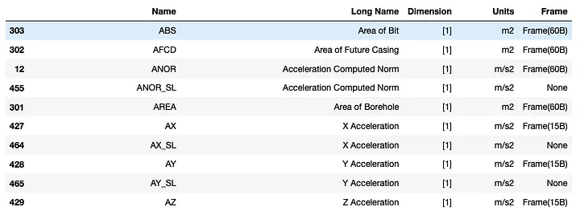
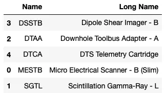
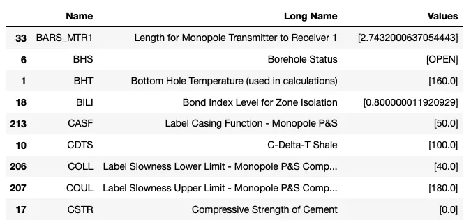
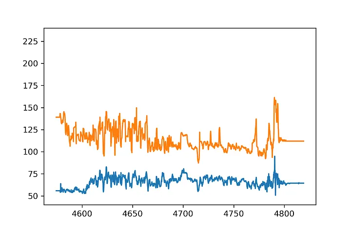
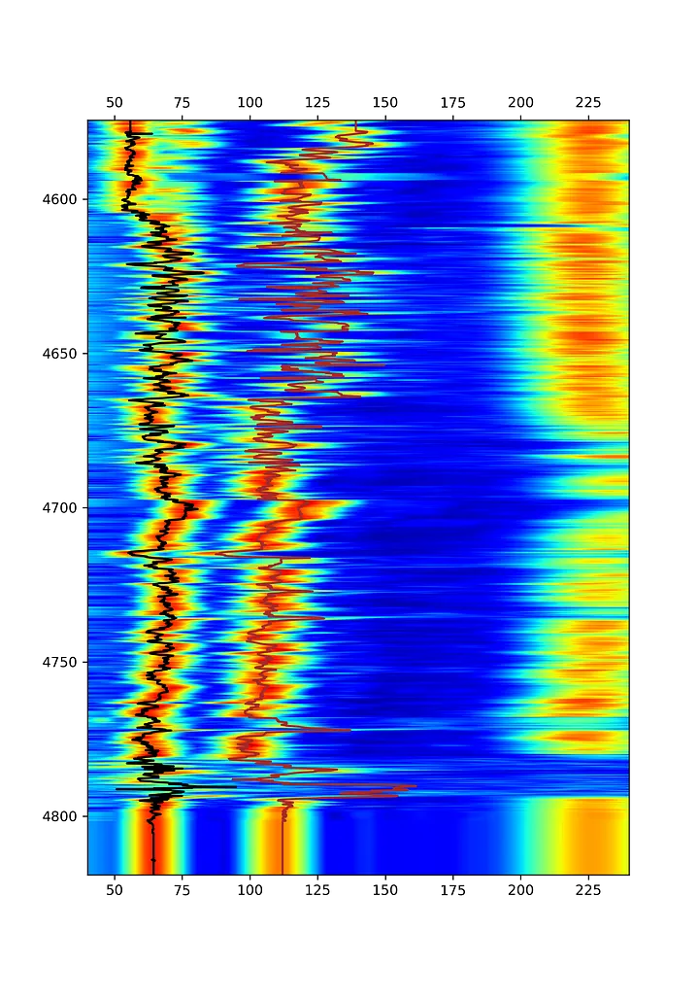
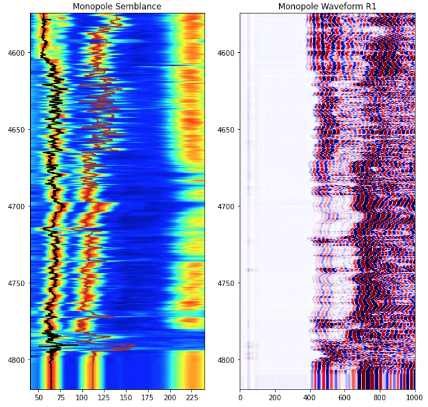
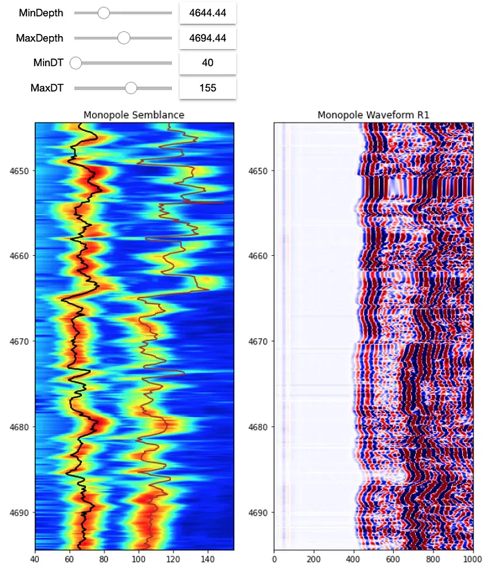

*This article was originally published on [Substack](https://andymcdonaldgeo.substack.com/p/loading-well-log-data-from-dlis-using-python-9d48df9a23e2).*

There are a number of different formats that well log and petrophysical data can be stored in. In the earlier articles and notebooks of this series, we have mainly focused on loading data from CSV files and LAS files. Even though LAS files are one of the common formats, they have a flat structure with a header section containing metadata about the well and the file followed by a series of columns containing values for each logging curve. As they are flat, they can't easily store array data. It is possible, but the individual elements of the array are split out into individual columns/curves within a LAS file as opposed to a single array. This is where DLIS files come in.

Within this article, we will cover:

- the basics of loading a DLIS file
- exploring the contents and parameters within a DLIS file
- displaying processed acoustic waveform data

We will not be covering acoustic waveform processing. Just the display of previously processed data.

This article was inspired by the work of [Erlend M. Viggen](https://erlend-viggen.no/dlis-files/) who has created an excellent Jupyter Notebook which goes into more detail about working with DLIS files.

## DLIS Files

Digital Log Interchange Standard (DLIS) files are structured binary files that contain data tables for well information and well logging data. The file format was developed in the late 1980's by Schlumberger and subsequently published in 1991 by the American Petroleum Institute to create a standardised well log data format. Full details of the standard format can be found [here](http://w3.energistics.org/rp66/v1/Toc/main.html). The DLIS file format can often be difficult and awkward to work with at times due to the format being developed nearly 30 years ago, and different software packages and vendors can create their own flavours of DLIS by adding in new structures and object-types.

DLIS files contain large amounts of metadata associated with the well and data. These sections do not contain the well data, these are stored within Frames, of which there can be many representing different logging passes/runs or processing stages (e.g. Raw or Interpreted). Frames are table objects which contain the well log data, where each column represents a logging curve, and that data is indexed by time or depth. Each logging curve within the frame is referred to as a channel. The channels can be a single dimension or multi-dimensional.

## dlisio

dlisio is a python library that has been developed by Equinor ASA to read DLIS files and Log Information Standard79 (LIS79) files. Details of the library can be found [here](https://dlisio.readthedocs.io/en/stable/index.html).

## Data

The data used within this article was sourced from the [NLOG: Dutch Oil and Gas Portal](https://www.nlog.nl/en/welcome-nlog).

**Privacy Notice:** DLIS files can contain information that can identify individuals that were involved in the logging operations. To protect their identity from appearing in search engine results without their explicit consent, these fields have been hidden in this article.

This article forms part of my Python & Petrophysics series. Details of the full series can be found [here](http://andymcdonald.scot/python-and-petrophysics). You can also find my Jupyter Notebooks and datasets on my GitHub repository at [https://github.com/andymcdgeo/Petrophysics-Python-Series](https://github.com/andymcdgeo/Petrophysics-Python-Series).

To follow along with this article, the Jupyter Notebook can be found at the link above and the data file for this article can be found in the [Data subfolder](https://github.com/andymcdgeo/Petrophysics-Python-Series/tree/master/Data) of the Python & Petrophysics repository.

## Library Imports

The first step with any project is to load in the libraries that we want to use. For this notebook we will be using NumPy for working with arrays, pandas for storing data, and matplotlib for displaying the data. To load the data, we will be using the dlisio library.

Also, as we will be working with dataframes to view parameters, which can be numerous, we need to change the maximum number of rows that will be displayed when that dataframe is called. This is achieved by `pd.set_option('display.max_rows', 500)`.

```python
from dlisio import dlis
import numpy as np
import pandas as pd
import matplotlib.pyplot as plt

pd.set_option('display.max_rows', 500)
```

## Loading a DLIS File

As we are working with a single DLIS file, we can use the following code to load the file. A physical DLIS file can contain multiple logical files, therefore using this syntax allows the first file to be output to `f` and any subsequent logical files are placed into `tail`.

```python
f, *tail = dlis.load('Data/NLOG_LIS_LAS_7857_FMS_DSI_MAIN_LOG.DLIS')
```

We can see the contents of each of these by calling upon their names. If we call upon `f`, we can see that it returns a `LogicalFile(00001_AC_WORK)` and if we call upon `tail`, we get a blank list, which lets us know that there are no other logical files within the DLIS.

```python
print(f)
print(tail)
```

Which returns:

```
LogicalFile(00001_AC_WORK)
[]
```

To view the high-level contents of the file we can use the `.describe()` method. This returns information about the number of frames, channels, and objects within the Logical File. When we apply this to `f` we can see we have a file with 4 frames and 484 channels (logging curves), in addition to a number of known and unknown objects.

```python
f.describe()
```

Which returns:

```
------------
Logical File
------------
Description : LogicalFile(FMS_DSI_138PUP)
Frames      : 4
Channels    : 484

Known objects
--
FILE-HEADER             : 1
ORIGIN                  : 1
AXIS                    : 50
EQUIPMENT               : 27
TOOL                    : 5
PARAMETER               : 480
CALIBRATION-MEASUREMENT : 22
CALIBRATION-COEFFICIENT : 12
CALIBRATION             : 341
PROCESS                 : 3
CHANNEL                 : 484
FRAME                   : 4

Unknown objects
--
440-CHANNEL                  : 538
440-PRESENTATION-DESCRIPTION : 1
440-OP-CHANNEL               : 573
```

## Viewing the File's Metadata

### Data Origin

The first set of metadata we will look at is the origin. This provides information about the source of the data within the file. Occasionally, data may originate from multiple sources so we need to account for this by unpacking the origins into two variables. We can always check if there is other origin information by printing the length of the list.

```python
origin, *origin_tail = f.origins
print(len(origin_tail))
```

When we view the length of `origin_tail`, we can see it has a length of 2. For this article, we will focus on `origin`. We can view the details of it, by calling upon `describe()`. This provides details about the field, well, and other file information.

```python
origin.describe()
```

Which returns:

```
------
Origin
------
name   : DLIS_DEFINING_ORIGIN
origin : 41
copy   : 0

Logical file ID          : FMS_DSI_138PUP
File set name and number : WINTERSHALL/L5-9 / 41
File number and type     : 170 / PLAYBACK

Field                   : L5
Well (id/name)          :  / L5-9
Produced by (code/name) : 440 / Schlumberger
Produced for            : Wintershall Noordzee B.V.
Run number              : -1
Descent number          : -1
Created                 : 2002-02-17 18:18:52

Created by              : OP, (version: 9C2-303)
Other programs/services : MESTB: Micro Electrical Scanner - B (Slim)  SGTL: Scintillation Gamma-Ray - L DTAA: Downhole Toolbus Adapter - A          DSSTB: Dipole Shear Imager - B DTCA: DTS Telemetry CartridgeACTS: Auxiliary Compression Tension Sub - B DIP: Dip Computation DIR: Directional Survey Computation HOLEV: Integrated Hole/Cement Volume
```

### Frames

Frames within a DLIS file can represent different logging passes or different stages of data, such as raw well log measurements to petrophysical interpretations or processed data. Each frame has a number of properties. The example code below prints out the properties in an easy-to-read format.

```python
for frame in f.frames:

    # Search through the channels for the index and obtain the units
    for channel in frame.channels:
        if channel.name == frame.index:
            depth_units = channel.units

    print(f'Frame Name: \t\t {frame.name}')
    print(f'Index Type: \t\t {frame.index_type}')
    print(f'Depth Interval: \t {frame.index_min} - {frame.index_max} {depth_units}')
    print(f'Depth Spacing: \t\t {frame.spacing} {depth_units}')
    print(f'Direction: \t\t {frame.direction}')
    print(f'Num of Channels: \t {len(frame.channels)}')
    print(f'Channel Names: \t\t {str(frame.channels)}')
    print('\n\n')
```

This returns the following summary. Which indicates that four frames exist within this file. With the first frame containing basic well log curves of bitsize (BS), caliper (CS), gamma ray (GR) and tension (TENS). The second frame contains the post-processed acoustic waveform data.

```
Frame Name: 		 60B
Index Type: 		 BOREHOLE-DEPTH
Depth Interval: 	 0 - 0 0.1 in
Depth Spacing: 		 -60 0.1 in
Direction: 		 DECREASING
Num of Channels: 	 77
Channel Names: 		 [Channel(TDEP), Channel(BS), Channel(CS), Channel(TENS), Channel(ETIM), Channel(DEVI), Channel(P1AZ_MEST), Channel(ANOR), Channel(FINC), Channel(HAZI), Channel(P1AZ), Channel(RB), Channel(SDEV), Channel(GAT), Channel(GMT), Channel(ECGR), Channel(ITT), Channel(SPHI), Channel(DCI2), Channel(DCI4), Channel(SOBS), Channel(DTCO), Channel(DTSM), Channel(PR), Channel(VPVS), Channel(CHR2), Channel(DT2R), Channel(DTRP), Channel(CHRP), Channel(DTRS), Channel(CHRS), Channel(DTTP), Channel(CHTP), Channel(DTTS), Channel(CHTS), Channel(DT2), Channel(DT4P), Channel(DT4S), Channel(SPCF), Channel(DPTR), Channel(DPAZ), Channel(QUAF), Channel(DDIP), Channel(DDA), Channel(FCD), Channel(HDAR), Channel(RGR), Channel(TIME), Channel(CVEL), Channel(MSW1), Channel(MSW2), Channel(FNOR), Channel(SAS2), Channel(SAS4), Channel(PWF2), Channel(PWN2), Channel(PWF4), Channel(PWN4), Channel(SVEL), Channel(SSVE), Channel(SPR2), Channel(SPR4), Channel(SPT4), Channel(DF), Channel(CDF), Channel(CLOS), Channel(ED), Channel(ND), Channel(TVDE), Channel(VSEC), Channel(CWEL), Channel(AREA), Channel(AFCD), Channel(ABS), Channel(IHV), Channel(ICV), Channel(GR)]


Frame Name: 		 10B
Index Type: 		 BOREHOLE-DEPTH
Depth Interval: 	 0 - 0 0.1 in
Depth Spacing: 		 -10 0.1 in
Direction: 		 DECREASING
Num of Channels: 	 4
Channel Names: 		 [Channel(TDEP), Channel(IDWD), Channel(TIME), Channel(SCD)]


Frame Name: 		 1B
Index Type: 		 BOREHOLE-DEPTH
Depth Interval: 	 0 - 0 0.1 in
Depth Spacing: 		 -1 0.1 in
Direction: 		 DECREASING
Num of Channels: 	 84
Channel Names: 		 [Channel(TDEP), Channel(TIME), Channel(EV), Channel(BA28), Channel(BA17), Channel(BB17), Channel(BC13), Channel(BD13), Channel(BB28), Channel(BA13), Channel(BB13), Channel(BC17), Channel(BD17), Channel(BA22), Channel(BA23), Channel(BA24), Channel(BC28), Channel(BA25), Channel(BA26), Channel(BA27), Channel(BA11), Channel(BA12), Channel(BA14), Channel(BA15), Channel(BA16), Channel(BA18), Channel(BA21), Channel(BC11), Channel(BC12), Channel(BC14), Channel(BC15), Channel(BC16), Channel(BC18), Channel(BC21), Channel(BC22), Channel(BC23), Channel(BC24), Channel(BC25), Channel(BC26), Channel(BC27), Channel(BB22), Channel(BB23), Channel(BB24), Channel(BD28), Channel(BB25), Channel(BB26), Channel(BB27), Channel(BB11), Channel(BB12), Channel(BB14), Channel(BB15), Channel(BB16), Channel(BB18), Channel(BB21), Channel(BD11), Channel(BD12), Channel(BD14), Channel(BD15), Channel(BD16), Channel(BD18), Channel(BD21), Channel(BD22), Channel(BD23), Channel(BD24), Channel(BD25), Channel(BD26), Channel(BD27), Channel(SB1), Channel(DB1), Channel(DB2), Channel(DB3A), Channel(DB4A), Channel(SB2), Channel(DB1A), Channel(DB2A), Channel(DB3), Channel(DB4), Channel(FCAX), Channel(FCAY), Channel(FCAZ), Channel(FTIM), Channel(AZSNG), Channel(AZS1G), Channel(AZS2G)]


Frame Name: 		 15B
Index Type: 		 BOREHOLE-DEPTH
Depth Interval: 	 0 - 0 0.1 in
Depth Spacing: 		 -15 0.1 in
Direction: 		 DECREASING
Num of Channels: 	 12
Channel Names: 		 [Channel(TDEP), Channel(TIME), Channel(C1), Channel(C2), Channel(U-MBAV), Channel(AX), Channel(AY), Channel(AZ), Channel(EI), Channel(FX), Channel(FY), Channel(FZ)]
```

### Parameters within the DLIS File

As seen earlier, we have a number of objects associated with the DLIS file. To make them easier to read we can create a short function that creates a pandas dataframe containing the parameters.

```python
def summary_dataframe(object, **kwargs):
    # Create an empty dataframe
    df = pd.DataFrame()

    # Iterate over each of the keyword arguments
    for i, (key, value) in enumerate(kwargs.items()):
        list_of_values = []

        # Iterate over each parameter and get the relevant key
        for item in object:
            # Account for any missing values.
            try:
                x = getattr(item, key)
                list_of_values.append(x)
            except:
                list_of_values.append('')
                continue

        # Add a new column to our data frame
        df[value] = list_of_values

    # Sort the dataframe by column 1 and return it
    return df.sort_values(df.columns[0])
```

The logging parameters can be accessed by calling upon `f.parameters`. To access the parameters, we can use the attributes `name`, `long_name` and `values` and pass these into the summary function.

```python
param_df = summary_dataframe(f.parameters, name='Name', long_name='Long Name', values='Value')

# Hiding people's names that may be in parameters.
# These two lines can be commented out to show them
mask = param_df['Name'].isin(['R8', 'RR1', 'WITN', 'ENGI'])
param_df = param_df[~mask]

param_df
```

This returns a long table of each of the parameters. The example below is a small section of that table. From it, we can see parameters such as bottom log interval, borehole salinity and bottom hole temperature.



### Channels within the DLIS File

The channels within a frame are the individual curves or arrays. To view a quick summary of these, we can pass in a number of attributes to the `summary_dataframe()` method.

```python
channels = summary_dataframe(f.channels, name='Name', long_name='Long Name',
                            dimension='Dimension', units='Units', frame='Frame')
channels
```

This returns yet another long table with all the curves contained within the file, and the frame the data belongs to.



### Tools within the DLIS File

The tools object within the DLIS file contains information relating to the tools that were used to acquire the data. We can get a summary of the tools available by calling upon the `summary_dataframe` method.

```python
tools = summary_dataframe(f.tools, name='Name', description='Description')
tools
```

This returns a short table containing 5 tools:



As we are looking to plot acoustic waveform data, we can look at the parameters for the DSSTB — Dipole Shear Imager tool. First, we need to grab the object from the dlis and then pass it into the `summary_dataframe` function.

```python
dsstb = f.object('TOOL', 'DSSTB')
dsstb_params = summary_dataframe(dsstb.parameters, name='Name', long_name='Long Name', values='Values')
dsstb_params
```

From the returned table, we can view each of the parameters that relate to the tool and the processing of the data.



## Plotting Data

Now that some of the metadata has been explored, we can now attempt to access the data stored within the file.

Frames and data can be accessed by calling upon the `.object()` for the file. First, we can assign the frames to variables, which will make things easier when accessing the data within them, especially if the frames contain channels/curves with the same name. The `.object()` method requires the type of the object being accessed, i.e. `'FRAME'` or `'CHANNEL'` and its name. In this case, we can refer back to the previous step which contains the channels and the frame names. We can see that the basic logging curves are in one frame and the acoustic data is in another.

```python
frame1 = f.object('FRAME', '60B')
```

We can also directly access the channels for a specific curve. However, this can cause confusion when working with frames containing channels/curves with the same name.

The example below shows how to call key properties of the channel/curve. Details of which can be found [here](https://dlisio.readthedocs.io/en/stable/dlis/api.html#dlisio.dlis.Channel).

```python
dtc = f.object('CHANNEL', 'DTCO')

# Print out the properties of the channel/curve
print(f'Name: \t\t{dtc.name}')
print(f'Long Name: \t{dtc.long_name}')
print(f'Units: \t\t{dtc.units}')
print(f'Dimension: \t{dtc.dimension}') #if >1, then data is an array
```

Which returns:

```
Name: 		DTCO
Long Name: 	Delta-T Compressional
Units: 		us/ft
Dimension: 	[1]
```

### Assigning Channels to Variables

Now that we know how to access the frames and channels of the DLIS file, we can now assign variable names to the curves that we are looking to plot. In this article, we will be plotting:

- **DTCO:** Delta-T Compressional
- **DTSM:** Delta-T Shear
- **SPR4:** STC Slowness Projection, Receiver Array — Monopole P&S
- **PWF4:** DSST Packed Waveform Data — Monopole P&S

We will also need to assign a depth curve (TDEP) from the frame. Looking back at the information section of the frame, the `Depth Interval` is 0.1 inches. This needs to be converted to metres by multiplying by 0.00254.

```python
curves = frame1.curves()

depth = curves['TDEP'] * 0.00254
dtco = curves['DTCO']
dtsm = curves['DTSM']
stc_mono = curves['SPR4']
wf_mono = curves['PWF4']

print(f'{depth.min()} - {depth.max()}')
```

When the depth min and max is printed out, we get the following range for the data:

```
4574.4384765625 - 4819.04052734375
```

To make an initial check on data, we can create a quick log plot of DTCO and DTSM against depth using matplotlib.

```python
plt.plot(depth, dtco)
plt.plot(depth, dtsm)
plt.ylim(40, 240)
plt.show()
```



### Plotting the Processed Semblance Map

We will start with setting up a subplot with two axes using `subplot2grid`. The first axis will contain the semblance plot and the second will be twinned with the first. This allows the data to be plotted on the same y-axis.

To plot the semblance data we need to use `imshow`. When we do this, we need to pass in the extent of the array both in terms of depth range (using `depth.min()` and `depth.max()`) and the data range (40 - 240 us/ft).

On top of that, the DTCO and DTSM curves can be plotted. This allows us to see how these curves were picked from the semblance map.

```python
fig, axes = plt.subplots(figsize=(7,10))

ax1 = plt.subplot2grid((1, 1), (0,0))
ax2 = ax1.twiny()

ax1.imshow(stc_mono, interpolation='bilinear', aspect='auto',
          cmap=plt.cm.jet, vmin=0, vmax=100,
           extent=[40, 240, depth.min(), depth.max()])

#Setting up the display depth range. Note that the
# depths need to be deepest first and shallowest second
ax1.set_ylim(depth.max(), depth.min())

ax2.plot(dtco, depth, color='black')
ax2.plot(dtsm, depth, color='brown')

ax2.set_xlim(40, 240)

plt.show()
```



### Plotting the Processed Waveform

We can modify the plot to add in a subplot for the acoustic waveform data associated with the semblance map. If we look at the shape of `wf_mono` we can see it returns `(1606, 8, 512)`. This indicates that the array is multi-dimensional. The middle number indicates that we have 8 receivers worth of data.

To access the first receiver, which is usually the closest one to the transmitter array, we can create a slice of the data like so:

```python
wf_r1 = wf_mono[:, 0, :]
print(wf_r1.min())
print(wf_r1.max())
```

This code returns the minimum and maximum values of the array, which can be used as a guide for scaling colours.

Taking the plot code from the semblance map section, we can enhance it by adding another subplot. In this subplot, we will use another `imshow()` plot and pass in the relevant parameters. The `vmin` and `vmax` parameters can be used to tweak the image to bring out or reduce the detail within the waveform.

```python
fig = plt.subplots(figsize=(10,10))

# Subplot for the semblance map
ax1 = plt.subplot2grid((1, 2), (0,0))

# Subplot for the DTC and DTS curves
ax2 = ax1.twiny()

# Subplot for the waveform data
ax3 = plt.subplot2grid((1, 2), (0,1))

ax1.imshow(stc_mono, interpolation='bilinear', aspect='auto',
          cmap=plt.cm.jet, vmin=0, vmax=100,
           extent=[40, 240, depth.min(), depth.max()])

ax1.set_title('Monopole Semblance')

ax2.plot(dtco, depth, color='black')
ax2.set_xlim(40, 240)
ax2.set_xticks([])

ax2.plot(dtco, depth, color='black')
ax2.plot(dtsm, depth, color='brown')

ax3.set_title('Monopole Waveform R1')
ax3.imshow(wf_r1, interpolation='bilinear', aspect='auto',
          cmap=plt.cm.seismic, vmin=-2000, vmax=2000,
           extent=[0, 3000, depth.min(), depth.max()])

ax3.set_xlim(0, 1000)

for ax in [ax1, ax2, ax3]:
    ax.set_ylim(depth.max(), depth.min())
```



### Adding Interactive Controls

Rather than rerunning the cell each time the depth and/or DT plot scales require changing, we can add a few interactive widgets to help with this. This can be achieved by importing `ipywidgets` and `IPython.display`.

The plot code can be placed inside a function and decorated with the widgets code. In the example below, we are passing in `MinDepth`, `MaxDepth`, `MinDT` and `MaxDT`. All four of which can be called upon in the code.

```python
import ipywidgets as widgets
from IPython.display import display

# Add the widgets decorator and setup the interactive variables
@widgets.interact(MinDepth=(depth.min(),depth.max(), 10),
                  MaxDepth=(depth.min(),depth.max(), 10),
                 MinDT=(40, 240, 5),
                 MaxDT=(40, 240, 5))
def acoustic_plot(MinDepth=depth.min(), MaxDepth=depth.max(),
                 MinDT=40, MaxDT=240):
    fig = plt.subplots(figsize=(10,10))

    # Subplot for the semblance map
    ax1 = plt.subplot2grid((1, 2), (0,0))

    # Subplot for the DTC and DTS curves
    ax2 = ax1.twiny()

    # Subplot for the waveform data
    ax3 = plt.subplot2grid((1, 2), (0,1))

    ax1.imshow(stc_mono, interpolation='bilinear', aspect='auto',
              cmap=plt.cm.jet, vmin=0, vmax=100,
               extent=[40, 240, depth.min(), depth.max()])
    ax1.set_xlim(MinDT, MaxDT)
    ax1.set_title('Monopole Semblance')

    ax2.plot(dtco, depth, color='black')
    ax2.set_xlim(MinDT, MaxDT)
    ax2.set_xticks([])

    ax2.plot(dtco, depth, color='black')
    ax2.plot(dtsm, depth, color='brown')

    ax3.set_title('Monopole Waveform R1')
    ax3.imshow(wf_r1, interpolation='bilinear', aspect='auto',
              cmap=plt.cm.seismic, vmin=-2000, vmax=2000,
               extent=[0, 3000, depth.min(), depth.max()])

    ax3.set_xlim(0, 1000)

    for ax in [ax1, ax2, ax3]:
        ax.set_ylim(MaxDepth, MinDepth)
```



## Summary

In this article, we have covered how to load a DLIS file using the dlisio Python library. Once the DLIS file is loaded, different parameter tables and logging curves can be viewed and extracted. We have also seen how we can take processed acoustic waveform data and plot it using matplotlib. DLIS files don't have to be daunting to work with in Python. Once the basic structure and commands from dlisio are understood it becomes much simpler.

## References

- Viggen, E.M. [Extracting data from DLIS Files](https://erlend-viggen.no/dlis-files/)
- Viggen, E.M, Harstad, E., and Kvalsvik J. (2020), Getting started with acoustic well log data using the dlisio Python library on the Volve Data Village dataset
- [NLOG: Dutch Oil and Gas Portal](https://www.nlog.nl/en/welcome-nlog)
