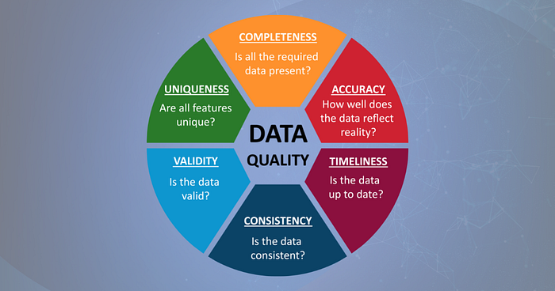
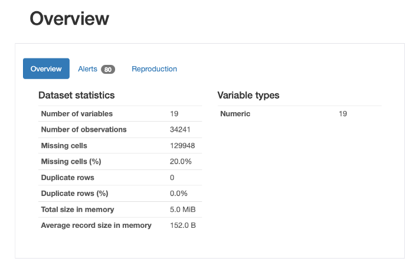
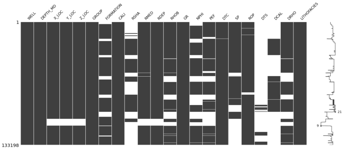
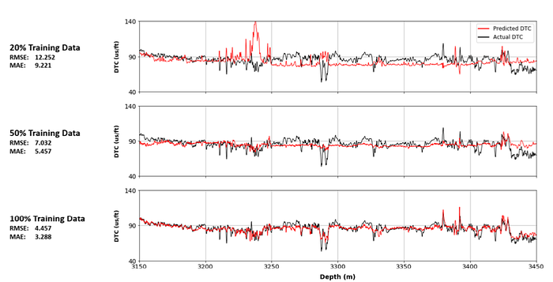
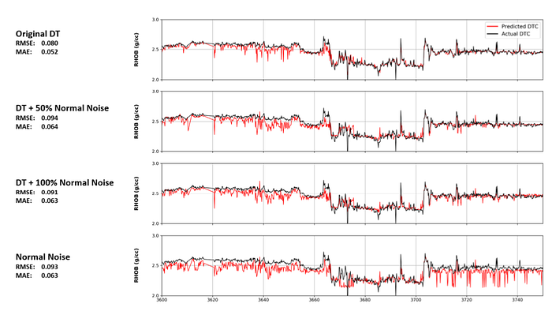
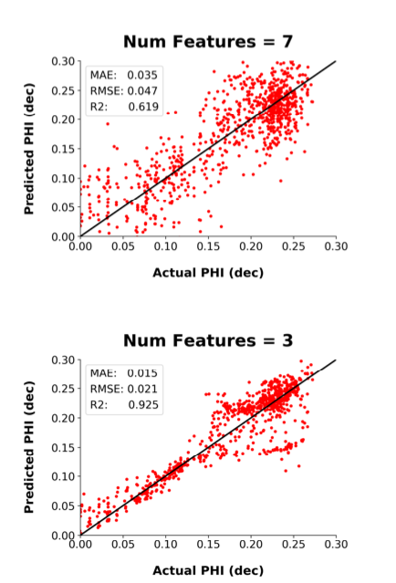

Ensuring you have good data quality prior to running machine learning algorithms is a crucial step within the overall data science and machine learning workflow. The use of poor-quality data can lead to severe degradation in the results and have further consequences when decisions are made on those results.

When starting out in the world of data science and machine learning, the datasets we are often presented with during training courses have been cleaned and set up to provide a good answer. However, in the real world, this is quite different.

Real-world data often contains many issues that range from values that are missing to erroneous values. If this is not dealt with prior to feeding the data into machine learning models it can result in serious consequences. These consequences can then have knock-on effects such as financial implications or even health and safety issues.

As the old saying goes, garbage in, garbage out. If we feed poor-quality data or incorrectly selected data into our models, we can expect that the result will also be of poor quality.

## What is Data Quality?

There are numerous definitions out there on the internet and within articles on what data quality actually is.

The most commonly used definition is "fitness for use for a specific purpose". This may involve ensuring that the data is suitable for achieving business goals, making informed and effective decisions, and optimising future operations.

Here are a few of the definitions from the literature on the subject.

From Mahanti (2019) — Data Quality: Dimensions, Measurement, Strategy, Management, and Governance:

> "Data quality is the capability of data to satisfy the stated business, system, and technical requirements of an enterprise. Data quality is an insight into or an evaluation of the data's fitness to serve their purpose in a given context"

[From Scannapieco & Catarci (2002)](https://www.researchgate.net/profile/Tiziana-Catarci/publication/228597426_Data_quality_under_a_computer_science_perspective/links/0fcfd51169a156b61a000000/Data-quality-under-a-computer-science-perspective.pdf)

> "The term "data quality" is used with reference to a set of characteristics that data should own, such as accuracy, i.e. a degree of correctness, or currency, i.e. a degree of updating."

And from [Haug, Zachariassen and Liempd (2013)](https://www.econstor.eu/bitstream/10419/188448/1/v04-i02-p168_232-1425-1-PB.pdf)

> "Data quality is often defined as 'fitness for use', i.e. an evaluation of to which extent some data serve the purposes of the user"

Data quality has also been defined by numerous governing bodies and organisations whose sole focus is on quality.

For example, within _**ISO 9000:2015**_ **(2015)**, quality is defined as the "degree to which a set of inherent characteristics of an object fulfils requirements," where inherent refers to a property that exists within an object as opposed to being assigned.

**Norwegian Standard, NS 5801** defines data quality as "conformance with specified requirements."

It should be noted that these definitions refer to the assessment of data quality as a relative property of the data as opposed to being absolute.

### The Cost of Poor Data Quality

The impact of using poor-quality data within a business and making decisions stretch beyond a simple case of missing rows, erroneous values and inconsistencies.

It can impact productivity. [According to Friedman and Smith](https://www.gartner.com/en/documents/1819214), poor data quality can lead to a 20% reduction in labour productivity.

It was also identified as being the main reason why 40% of new business initiatives fail.

In monetary terms, according to a [Gartner Quality Market Survey, poor data quality could be costing organisations up to $15 million per year](https://www.gartner.com/smarterwithgartner/how-to-create-a-business-case-for-data-quality-improvement). Also, [according to IBM, it could be costing the US economy upwards of $3.1 trillion per year.](https://www.entrepreneur.com/science-technology/bad-data-the-3-trillion-per-year-problem-thats-actually/393161)

Other impacts include:

-   Brand and reputational damage
-   Inefficiencies
-   Missed opportunities
-   Loss of revenue

## Dimensions of Data Quality

As seen above, a number of the definitions refer to dimensions or characteristics to define relative data quality.

There are 6 key dimensions that most publications are in alignment with. Let's have a closer look at them.

 *6 common characteristics of Data Quality. Image created by the Author (McDonald, 2021).*

**Completeness:** This is a measure of whether all of the required data is present within the dataset and if it meets the objectives of the project being worked on. If missing data are present, then it should be clear how these are handled.

Additionally, default values should also be checked within the data as they may give the illusion of completeness.

If data is missing within our dataset, it can create misleading trends and skew the results of our analysis.

**Accuracy:** This is a measure of how well the data accurately reflects the object being described.

In other words, how well does the data reflect reality?

**Timeliness:** This is a measure of the data being available when it is needed for decision-making. Is the data that is being worked on the latest version that is available to make appropriate interpretations?

We are constantly changing phone numbers, home addresses and email addresses. So ensuring we have the latest information is crucial.

If the data is out of date, then any decisions made on that data could be incorrect.

**Consistency:** This is a measure of how consistent the data is. The same data should be consistent across different storage locations, software packages and file formats.

**Validity:** This is a measure of how well the data fits within pre-defined limits, expectations and standards. This can apply to date formats, telephone numbers, sensor measurements and more.

For example, if you are expecting values of 1, 2 and 3, but are looking at data containing values of 1.5, 7, and 42, then those values are not valid.

**Uniqueness:** Features or objects should only be represented within a particular dataset once otherwise, confusion can occur.

Duplicate data, not only skews results but can increase computational processing times and storage space.

If multiple occurrences of the same feature are present within a dataset then the final one needs to be identified or amalgamated to form a composite feature.

### Identifying Poor Data With Python

There are numerous libraries available within Python that can help with exploratory data analysis and identifying issues within your data. I have covered a number of these in the past on Medium.

Here are just a few methods and libraries that can help:

**Pandas Profiling:** This is a great little library that can help you generate a very detailed statistical report on your data. You can see an example of the results below which identify missing data, duplicate rows and more.

You can find out more about [Pandas-Profiling here](https://towardsdatascience.com/pandas-profiling-easy-exploratory-data-analysis-in-python-65d6d0e23650).

 *The overview section of the pandas-profiling report. Image by the author.*

**Missingno:** A very simple-to-use library that can generate easy-to-understand visualisations of data completeness.

You can find out more about it [here](https://medium.com/r?url=https%3A%2F%2Ftowardsdatascience.com%2Fusing-the-missingno-python-library-to-identify-and-visualise-missing-data-prior-to-machine-learning-34c8c5b5f009)

 *missingno matrix plot showing data sparsity across all dataframe columns. Image by the author.*

**Detecting Outliers:** Detection of invalid data points can be achieved through standard plotting techniques with boxplots, scatterplots and histograms. But, outliers can also be identified with [unsupervised machine learning techniques such as Isolation Forest.](https://towardsdatascience.com/isolation-forest-auto-anomaly-detection-with-python-e7a8559d4562)

## Impacts of Poor Data Quality on Machine Learning Models

There are numerous impacts on machine learning models when poor quality data or incorrectly selected good data is used. As part of a study, which investigated the impacts of data quality issues on well log measurements, I ran a number of case studies illustrating the impacts.

Here are a few of the results.

### Impact of Missing Data

To simulate missing data, an experiment was set up whereby the training data available for an Artificial Neural Network was reduced in 10% increments. The test data was kept constant to ensure a fair comparison.

As seen below, when the full data (100% of the training data) was used to predict Acoustic Compressional Slowness (DTC), we produce a very good match with the target feature.

However, when the training data was reduced to 50%, the model begins to degrade, but still follows the overall trend. And when the model is reduced to just 20% of the original training data, the results are very poor compared to the target feature.

 *Impact of reduced training data on the performance of a simple Artificial Neural Network. Image by the author (McDonald, 2021)*

### Impact of Noisy Data

In the second case study, an assessment was made on the impact of introducing noise to one of the training features. This was to simulate sensor noise, which can lead to erroneous recordings.

The algorithm for this case study was Random Forest, which is a supervised machine learning algorithm and consists of multiple decision trees.

As seen in the results below, when noise is added to the DT feature, the prediction of RHOB becomes noisier. However, it still does a really good job at predicting the overall trend, which could be attributable to the way Random Forest works.

 *Impact of varying numbers of noisy inputs in the training data on a final model prediction of bulk density (RHOB). Image by the author (McDonald, 2021)*

### **Impact of Incorrectly Selected Features on Training**

Feature selection is a key step within the machine learning workflow. It allows us to identify which features will be the most relevant for predicting a target feature. It also allows us to reduce our training data set size, which in turn helps with computational processing times.

In the example below, when 7 features are used within this particular case study, the results were scattered when comparing the true measurement with the actual measurement. However, after reducing the features to 3, the fit was much better at lower porosities and slightly improved at higher porosities.

 *Scatter plot of actual porosity and predicted porosity for a varying number of inputs using Pearson's Correlation feature selection method. Image by the author. (McDonald 2022)*

### Further Details on Examples

If you want to find out more details about these examples, you can find my research paper below:

[McDonald, A. (2021) Data Quality Considerations for Petrophysical Machine-Learning Models. PETROPHYSICS](https://www.researchgate.net/publication/357867454_Data_Quality_Considerations_for_Petrophysical_Machine-Learning_Models)

## Summary

Ensuring data is of good quality prior to running machine learning models is essential. If poor quality data is used or inputs have been incorrectly selected it can result in severe consequences, which in turn can further knock-on impacts.
