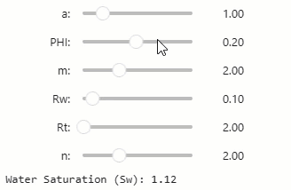

When you are learning a technical subject that has numerous equations and relationships, such as petrophysics, it can sometimes be difficult to understand how all of the parameters tie together.

Back when I started out in petrophysics many years ago, I used Excel to explore some common equations, such as the Archie Water Saturation equation. It was a great way to understand the impact of each of the parameters on the calculated result.

Within this article we will explore, with Python, three different ways that we can learn and understand the impacts of different parameters on an equation. The example equation used is the Archie Water Saturation (Sw) equation, which is used to calculate the amount of pore volume within a rock that is filled with water. This can then be used to infer how much hydrocarbon is present in the rock.

If you are not familiar with petrophysics, then the same workflow and examples can be applied to any equation of your choice. You may need to adjust the final example to show the data you want to see.

### Simple Equation as a Function

The simplest way to explore an equation is to create a function with the calculations. This function will accept a number of parameters, each of which is assigned a default value.

By providing default values for the parameters it allows us to call upon the parameters we want to change rather than entering them each time. For example, if we want to change the `rt` parameter, we would call upon the function like so: `archie_sw(rt=100)`

```python
def archie_sw(a=1, phi=0.15, m=2, rw=0.2, rt=200, n=2):
    Sw = ((a / phi**m) * (rw / rt))**(1/n)
    return Sw
```

However, to begin with, if we call the function and provide no parameters, then the default values will be used.

```python
archie_sw()
```

And this will return an Sw of:

```bash
0.21081851067789195
```

If we change some of the parameters, such as the tortuosity (`a`) and porosity (`phi` ) parameters:

```python
archie_sw(a=1.2, phi=0.25)
```

We will get back a new Sw value of

```bash
0.13856406460551018
```

Whilst this is a nice and simple way to explore the Archie equation's parameters, it can become very tedious and time consuming having to change the values and re-run the cell(s).

### Creating Interactivity Using ipywidgets

Rather than having to re-run and call the function each time we want to change a parameter, we can use interactive widgets within our notebook.

This is done by importing widgets from **ipywidgets** and setting up a number of sub-widgets that are tied to each of the parameters.

First, we need to import a few modules, the first is `widgets` from `ipywidgets` and in order to display our widgets within the notebook we have to import `display` from `IPython.display`.

Next, we declare our Archie Water Saturation equation, and the associated parameters. This function is then called within the `update_widget` function, which will

Finally, we can setup what widgets we want to display, along with their type, default values and their range of accepted values.

```python
import ipywidgets as widgets
from IPython.display import display

# Archie's Equation function
def archie_sw(a, PHI, m, Rw, Rt, n):
    Sw = ((a / PHI**m) * (Rw / Rt))**(1/n)
    return Sw

# Interactive widget
def update_widget(a=1, PHI=0.2, m=2, Rw=0.1, Rt=2, n=2):
    Sw = archie_sw(a, PHI, m, Rw, Rt, n)
    print(f"Water Saturation (Sw): {Sw:.2f}")

widgets.interact(update_widget, 
                 a=widgets.FloatSlider(value=1, min=0.1, max=5, step=0.1, description='a:'),
                 PHI=widgets.FloatSlider(value=0.2, min=0.01, max=0.4, step=0.01, description='PHI:'),
                 m=widgets.FloatSlider(value=2, min=1, max=4, step=0.1, description='m:'),
                 Rw=widgets.FloatSlider(value=0.1, min=0.01, max=1, step=0.01, description='Rw:'),
                 Rt=widgets.FloatSlider(value=2, min=1, max=100, step=1, description='Rt:'),
                 n=widgets.FloatSlider(value=2, min=1, max=4, step=0.1, description='n:'))
```

When we run the above cell in our notebook, we get the following interactive sliders displayed.

<br/>*Using ipywdigets to interactively change key Archie parameters. Image by the author.*

When any of the sliders are adjusted the resulting Sw updates automatically.

### Using ipywidgets in Jupyter (Dataframe + Log Plot)

When dealing with petrophysical interpretations, we are often working with continuous data rather than a single data point. The previous method keeps things simple if we want to explore each parameter and its impacts on a single Sw value.

We can expand what we have done above by using some real-world data and creating a basic log plot that will update when any of the parameters change.

In this example, from the publicly available Volve dataset, we have a porosity ( `phi` ) curve and a resistivity ( `rt` ) curve. Both of which are essential inputs to the Archie water saturation equation.

The remaining parameters can then be tweaked to illustrate the impacts over a full reservoir section.

On the top most subplot (track) we have the water saturation as calculated using the default parameters to give us a baseline. This is plotted alongside the result calculated using the interactive parameters.


To generate the above plot, you can use the following code.

```python
import pandas as pd
import matplotlib.pyplot as plt
import ipywidgets as widgets
from IPython.display import display

df = pd.read_csv('../data/Volve/15_9-19.csv', usecols=['DEPTH','PHIT', 'GR','RT'], na_values=-999)

#Extract a small depth interval
df = df.query('3800 <= DEPTH <= 4100')

def archie_sw(a=1, phi=0.15, m=2, rw=0.2, rt=200, n=2):
    Sw = ((a / phi**m) * (rw / rt))**(1/n)
    return Sw

df['SW_ARCH_BASE'] = df.apply(lambda row: archie_sw(phi=row['PHIT'], rt=row['RT']), axis=1)

@widgets.interact(a=(0.5, 1.5, 0.05),
                  m=(1.5, 2.5, 0.05),
                  rw = (0.1, 10, 0.1),
                  n=(1.5, 2.5, 0.05))                  
def update_plot(a=1, m=2, rw=1, n=2):
    depth = df['DEPTH']

    df['SW_ARCH_NEW'] = df.apply(lambda row: archie_sw(phi=row['PHIT'], rt=row['RT'], 
                                                      a=a,
                                                      m=m,
                                                      rw=rw,
                                                      n=n), axis=1)
    
    fig, ax = plt.subplots(nrows=4, ncols=1, sharex=True, figsize=(20, 10))
    
    ax[0].plot(depth, df['SW_ARCH_BASE'], c='k')
    ax[0].plot(depth, df['SW_ARCH_NEW'], c='red')
    ax[0].fill_between(depth, 1, df['SW_ARCH_NEW'], color='green')
    ax[0].fill_between(depth, 0, df['SW_ARCH_NEW'], color='skyblue')

    ax[1].plot(depth, df['RT'], c='k')
    ax[2].plot(depth, df['PHIT'])
    ax[3].plot(depth, df['GR'], c='green')

    ax[0].set_ylim(0, 1.0)
    ax[1].semilogy()
    ax[2].set_ylim(0, 0.5)
    ax[3].set_ylim(0, 150)

    ax[0].set_ylabel('SW')
    ax[1].set_ylabel('RT')
    ax[2].set_ylabel('PHIT')
    ax[3].set_ylabel('Gamma')
    
    plt.show()
```

### Summary

The more interactive you can make your learning process the more likely you are to retain the information your are learning.

Within this article, I have shown three different, but simple ways that you can use Python to help you understand a fundamental equation within petrophysics. By allowing of the parameters to be interactive in the final example, we can explore the impacts of each of them on real world data.

### Dataset Used

The data used within this tutorial is a subset of the Volve Dataset that Equinor released in 2018. Full details of the dataset, including the licence, can be found at the link below

[Volve field data set download — Equinor](https://www.equinor.com/energy/volve-data-sharing?source=post_page-----ef7dfed94077--------------------------------)

The Volve data license is based on CC BY 4.0 license. Full details of the license agreement can be found here:

[https://cdn.sanity.io/files/h61q9gi9/global/de6532f6134b9a953f6c41bac47a0c055a3712d3.pdf?equinor-hrs-terms-and-conditions-for-licence-to-data-volve.pdf](https://cdn.sanity.io/files/h61q9gi9/global/de6532f6134b9a953f6c41bac47a0c055a3712d3.pdf?equinor-hrs-terms-and-conditions-for-licence-to-data-volve.pdf=)
